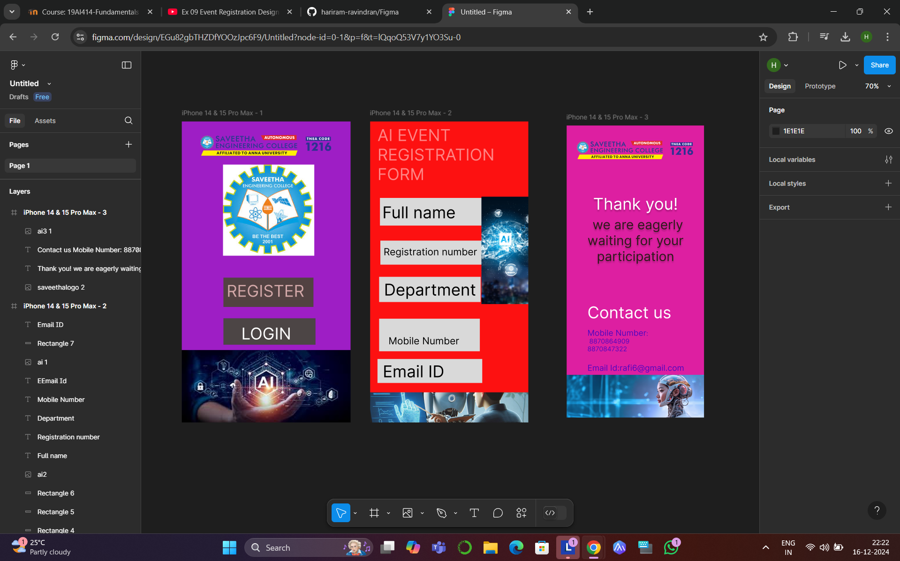
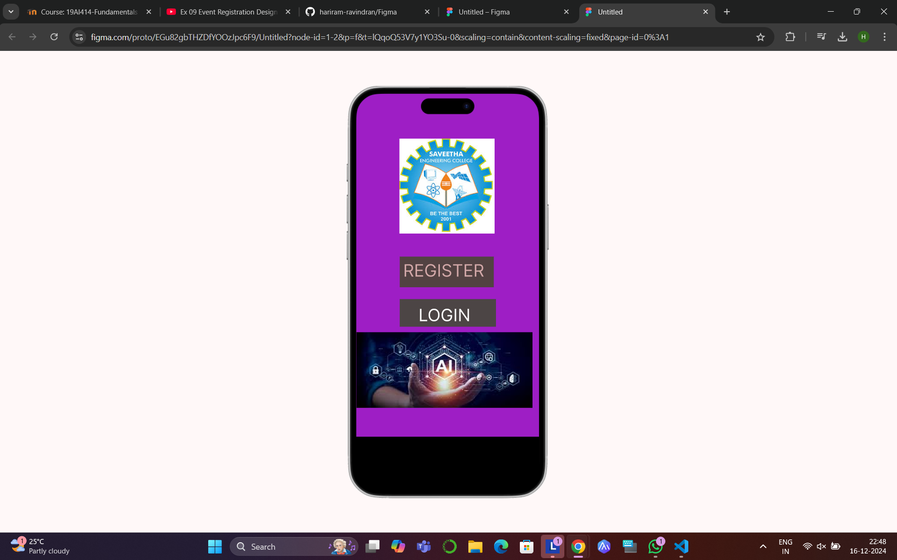
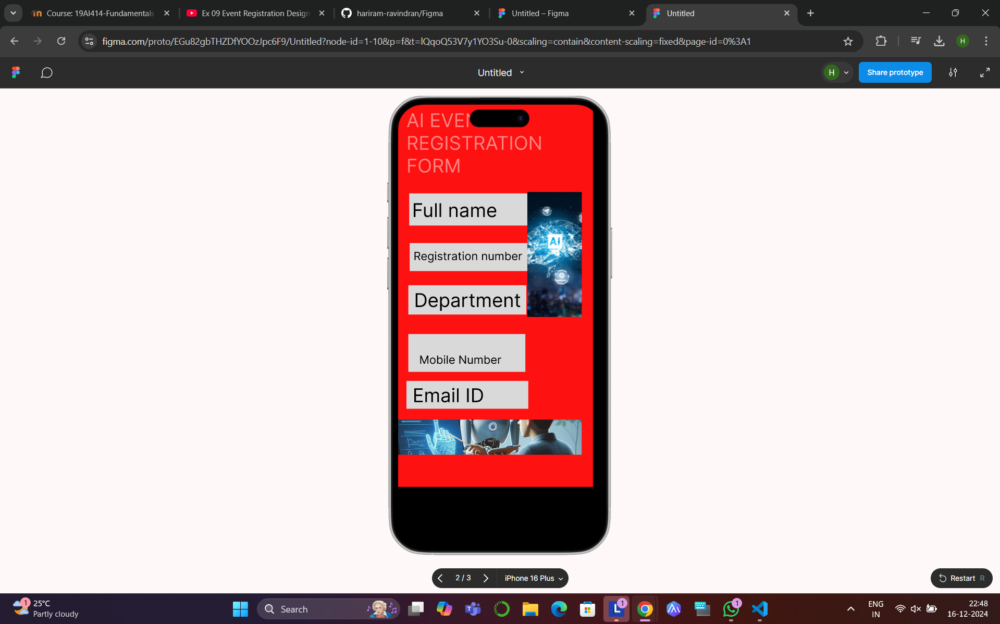
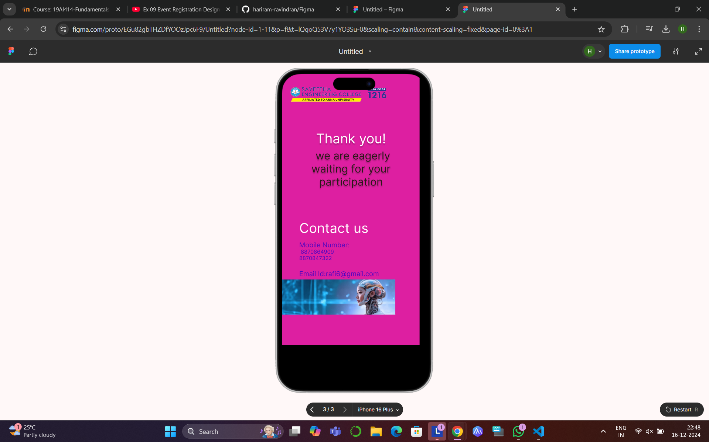

# Ex09 Event Registration Web Application
## Date:16.12.2024

## AIM:
To design, develop and deploy a web application for event registration.

## DESIGN STEPS:

### Step 1:
Create a new frame.

### Step 2:
Select any one preset size of your choice.

### Step 3:
Select the shapes you need.

### Step 4:
Import images as needed.

### Step 5:
Create pages based on your need and link them.

### Step 6:

Validate the HTML and CSS code.

### Step 6:

Publish the website in the given URL.

## DESIGN TOOL:
Figma

## CODE:
```
home page 

<div class="container--0-">
  <svg
    width="221"
    height="72"
    viewBox="0 0 221 72"
    fill="none"
    xmlns="http://www.w3.org/2000/svg"
  >
    <rect width="221" height="72" fill="#524242"></rect>
  </svg>
  <div class="text-0-1-1">REGISTER</div>
  <svg
    width="226"
    height="65"
    viewBox="0 0 226 65"
    fill="none"
    xmlns="http://www.w3.org/2000/svg"
  >
    <rect width="226" height="65" fill="#4C4545"></rect>
  </svg>
  <div class="text-0-1-3">LOGIN</div>
  
</div>

register page

<div class="container--0-">
  <div class="text-0-1-0">AI EVENT REGISTRATION FORM</div>
  <svg
    width="256"
    height="68"
    viewBox="0 0 256 68"
    fill="none"
    xmlns="http://www.w3.org/2000/svg"
  >
    <rect width="256" height="68" fill="#D9D9D9"></rect></svg
  ><svg
    width="253"
    height="59"
    viewBox="0 0 253 59"
    fill="none"
    xmlns="http://www.w3.org/2000/svg"
  >
    <rect width="253" height="59" fill="#D9D9D9"></rect></svg
  ><svg
    width="249"
    height="62"
    viewBox="0 0 249 62"
    fill="none"
    xmlns="http://www.w3.org/2000/svg"
  >
    <rect width="249" height="62" fill="#D9D9D9"></rect></svg
  ><svg
    width="247"
    height="80"
    viewBox="0 0 247 80"
    fill="none"
    xmlns="http://www.w3.org/2000/svg"
  >
    <rect width="247" height="80" fill="#D9D9D9"></rect></svg
  ><svg
    width="257"
    height="59"
    viewBox="0 0 257 59"
    fill="none"
    xmlns="http://www.w3.org/2000/svg"
  >
    <rect width="257" height="59" fill="#D9D9D9"></rect>
  </svg>
  <div class="text-0-1-13">Email ID</div>
</div>

contact page
<div class="container--0-">
  
  <div class="text-0-1-1">
    Thank you!<br />
    we are eagerly waiting for your participation
  </div>
  <div class="text-0-1-2">
    Contact us<br /><br />Mobile Number:<br />
    8870864909<br />8870847322<br /><br />Email Id:rafi6@gmail.com
  </div>
  
</div>
```
## OUTPUT:





## RESULT:
The program to design, develop and deploy a web application for event registration is completed successfully.
